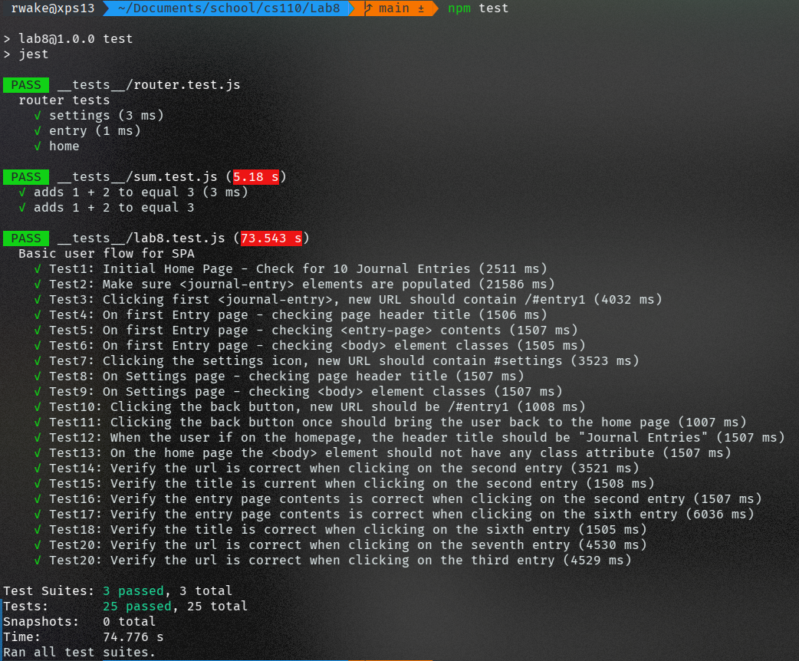

# Lab8_Starter
Robert Wakefield-Carl

## Screenshot



## Check your understanding q's (FILL OUT)
1. In your own words: Where would you fit your automated tests in your Bujo project development pipeline? (just write the letter)

  1

2. Would you use a unit test to test the “message” feature of a messaging application? Why or why not? For this question, assume the “message” feature allows a user to write and send a message to another user.

  No, because it probably involves several moving parts, not just an individual
function or part.

3. Would you use a unit test to test the “max message length” feature of a messaging application? Why or why not? For this question, assume the “max message length” feature prevents the user from typing more than 80 characters

  Yes, because this feature probably involves only a few functions that can be
easily tested together.

4. What do you expect to happen if we run our puppeteer tests with the field “headless” set to true?

  The browser will not be shown during the tests, so we will not see the framework
interacting with the webpage.

5. What would your beforeAll callback look like if you wanted to start from the settings page before every test case?

    ```js
    beforeEach(async () => {
        await page.goto('http://127.0.0.1:5500'); // change to settings page
    });
    ```
